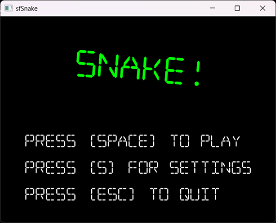
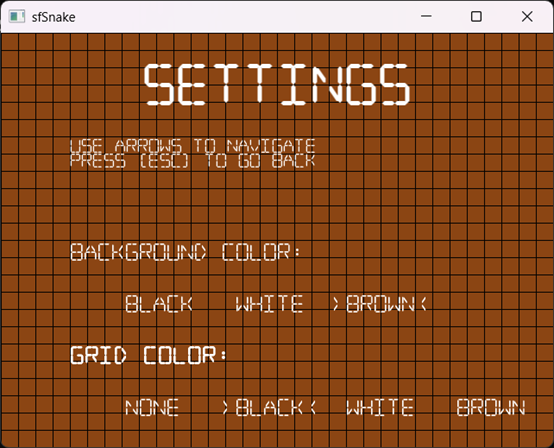
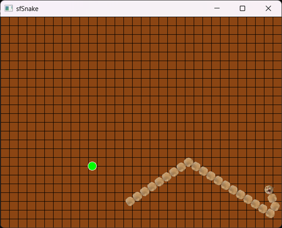
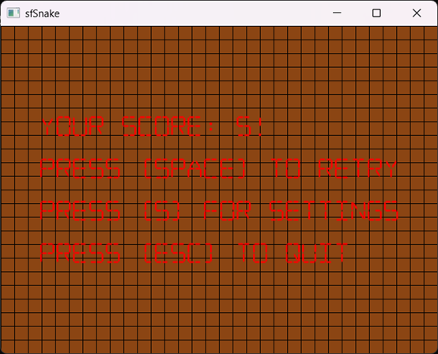

# MAODIE Snake Game
A classic Snake game built with C++17 and [SFML 2.6.0](https://www.sfml-dev.org/), based on the open-source project [sfSnake by jhpy1024](https://github.com/jhpy1024/sfSnake), with new features and improvements added.

## Features
- Support mouse control
- Various randomly generated fruits with different effects
- Interesting sound effects and textures
- Background and grid with various colors to choose from

## Screen Shots





## Build Instruction
### Prerequisites
- CMake 3.28+
- Visual Studio 2022 with MSVC runtime supporting C++17
- No need to download SFML separately — compiled SFML-2.6.0 is included in 3rd directory
### Steps
1. Clone the repository:
   ```bash
   git clone https://github.com/Ph4BK/maodie.git
   cd maodie
   ```
2. Build:
   ```bash
   build.bat
   ```
3. After a successful build, the executable can be found in:
   build\bin\Release

Enjoy the game! Contributions, issues, and stars are welcome ⭐